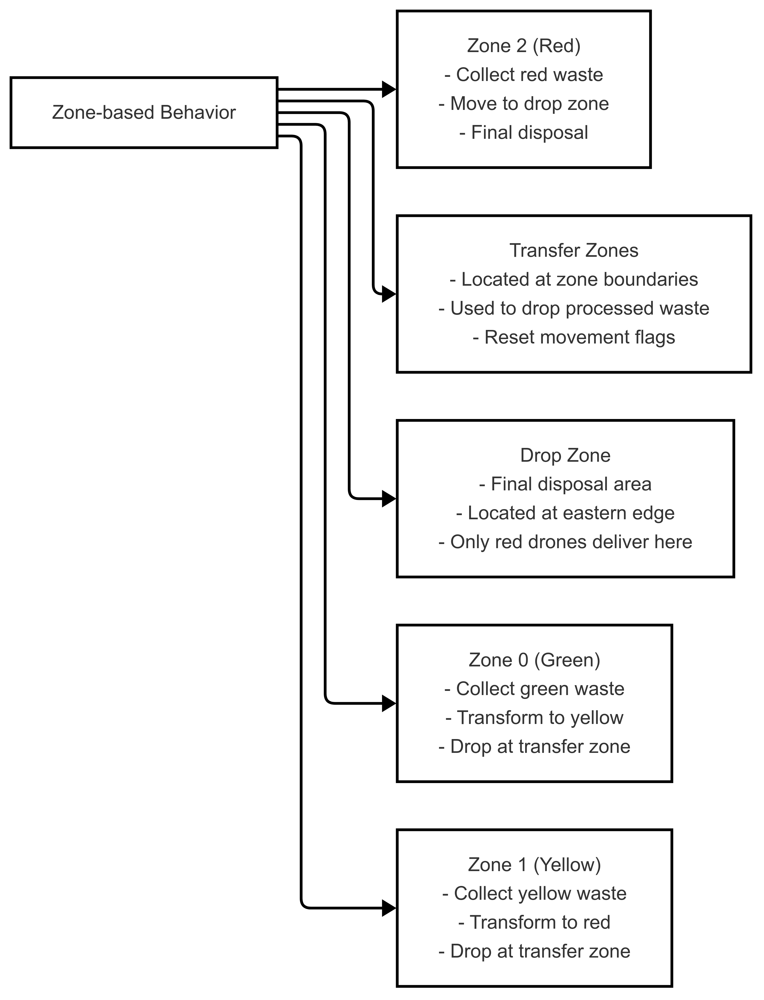

# cs-multi-agents-systems-project

A project focused on designing, simulating, and analyzing multi-agent systems, implementing coordination, communication, and decision-making strategies.

## Running the code

### Install the required packages

```bash
conda env create -f environment.yml
conda activate SMA
```

### Run the simulation

```bash
solara run src/server.py
```

### Run automated experiments

```bash
python src/run_experiments.py
```

Results are saved in the `results` folder.

## Multi-Agent Waste Processing System

### Proplem Statement

The project focuses on a multi-agent system designed to optimize the collection and processing of waste materials in a simulated environment. The system is composed of drone agents that operate in different zones, each with its own processing capabilities. The goal is to efficiently manage the waste collection and processing pipeline, ensuring that materials are refined and transferred through various stages.

### System Overview

The system consists of drone agents assigned to specific zones, each responsible for collecting, processing, and transferring waste materials through a pipeline of increasing refinement.

### Agent Types

The drones are specialized by zone type (0, 1, 2), which corresponds to different processing capabilities:

- **Green Zone Drones (zone_type=0)**: First-stage processors
- **Yellow Zone Drones (zone_type=1)**: Second-stage processors
- **Red Zone Drones (zone_type=2)**: Final-stage processors

### Special terms

- **Zone type**: Number representing the type of processing zone (0, 1, 2) corresponding to the color of the zone (green, yellow, red).
- **Zone**: A specific area in the simulation where agents operate and process waste materials. The size of the zone is third of the total size of the simulation area.
- **Waste**: The materials collected by agents which can have one of three types: green, yellow, or red. Each type corresponds to a specific stage in the processing pipeline.
- **Transfer** zone: A designated area where agents can transfer waste materials to other agents or zones for further processing. It is the area separating the zones from each other.
- **Drop zone**: A designated area where agents can drop off waste materials after processing. It is the last column of the simulation area.
- **Deadlock**: A situation where agents are stuck with only one waste type and cannot proceed to the next stage of processing for a long time.

### Visual Representations of the System

To better understand the system, the following diagrams illustrate various aspects of the multi-agent waste processing system:

#### 1. Agent Cycle


This diagram shows the overall cycle of an agent, including perception, deliberation, and action phases. It highlights how agents interact with their environment and make decisions.

#### 2. Update Process


This diagram details how agents update their knowledge base by processing percepts and messages. It includes steps like detecting waste, updating memory, and assigning targets.

#### 3. Deliberation Process


This diagram explains the decision-making process of agents, prioritizing actions such as waste collection, transformation, and movement.

#### 4. Action Implementations


This diagram provides an overview of the specific actions agents can perform, such as moving randomly, moving east, picking waste, and transforming waste.

#### 5. Knowledge and Communication


This diagram illustrates how agents share information and maintain a collective memory of waste locations, enabling coordinated behavior.

#### 6. Zone-Based Behavior


This diagram shows the behavior of agents in different zones, including waste collection, transformation, and delivery to transfer or drop zones.
